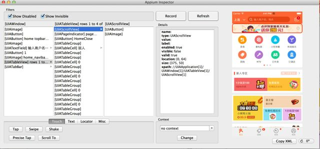

#IOS自动化中如何获取APP页面元素信息
*Authored By mengting.chen*
##1 用Appium客户端的Inspector工具
使用方法可以参考[文档](http://liontree.github.io/testing/2014/05/31/ios-uiautomation-appium-record/)  
启动Appium，建立连接，让App在Simulator里面跑起来
点击Appium客户端里面的放大镜图标打开inspector，可以看到它会和模拟器里面的界面对应起来，如果不对应，Refresh

##2 使用Webdriver的page_source
例如在python终端里连接上模拟器启动App

```python
from appium import webdriver
driver = webdriver.Remote(command_executor='http://127.0.0.1:4723/wd/hub',
    desired_capabilities={'app': '/Users/mengting/work/workspace/search_app_automation/Library/IOS/apps/DPScope7.5.app', 
    'platformName': 'iOS',
    'platformVersion': '8.0',
    'deviceName': 'iPhone 6'})
```                          
建立了连接，然后就可以对某个页面使用

```python
print driver.page_source
```
打印该页面上的所有元素信息
##3 使用UIAutomation的logElementTree
通过xcode里面的Instruments-UIAutomation，使用target.logElementTree()通过log看各个控件的信息，详细参看另一篇笔记*Notes of Using UIAutomation*
##4 (点评APP特有)使用debug面板的FLEX
在小虫子里，点击flex，用 select选择对应的页面元素，然后view，可以看到对应的view hierarchy，灰的就是对应的那个页面元素的viewer
##参考资料
1.<http://liontree.github.io/testing/2014/05/31/ios-uiautomation-appium-record/>
