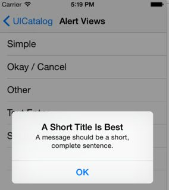
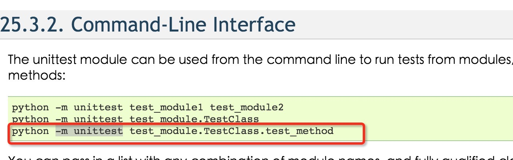
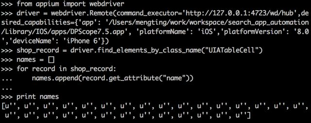
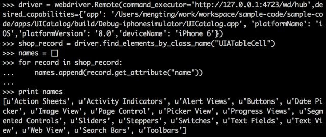
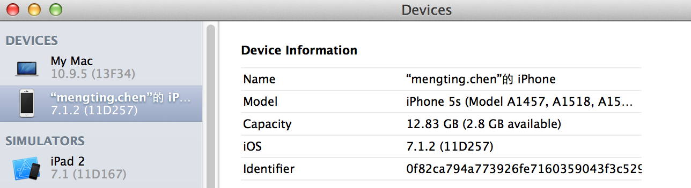
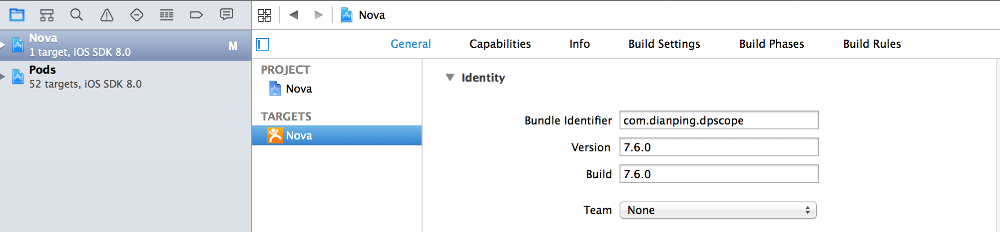

#Notes of Using Appium&Python-Client（Mainly For iOS)  
*Written By mengting.chen*  
##1 一些官方文档参考点  
###1.1 获取需要的.app    
利用xcode编译获取跑case需要的.app：
<http://appium.io/slate/en/master/?python#deploying-an-ios-app-to-a-real-device>
###1.2 一些常见错误  
<http://appium.io/slate/en/master/?python#ios>
###1.3 已知的问题  
<http://appium.io/slate/en/master/?python#known-issues>
##2 学习一些示例  
###2.1 官方示例  
[Appium 官方Sample Code](https://github.com/appium/sample-code/blob/master/sample-code/examples/python/)
####2.1.1 通过sample-code中的iOS脚本学习如何获取iOS客户端控件和控件属性  
2.1.1.1 获取控件对象  

>以下来自sample-code/examples/python/ios_simple.py

```python
#获取当前所有elements,结果是控件的list
driver.find_elements_by_ios_uiautomation('.elements()') 
#结合index获取一个element
driver.find_element_by_ios_uiautomation('.elements()[3]').text
#通过element的Name属性获取，需要name唯一
driver.find_element_by_name('TextField1')
#通过element的label属性获取，需要label唯一
driver.find_element_by_id('ComputeSumButton').click()
#通过控件类名获取，结果是list
driver.find_elements_by_class_name('UIAButton')

#通过xpath+value获取，一般用于webview
#switch到webview
driver.switch_to.context(driver.contexts[1])  
#通过xpath+value获取
driver.find_element_by_xpath('//*/UIATextField[@value="http://apple.com"]') 
#离开webview回到native 
driver.switch_to.context(contexts[0])
```
2.1.1.2 获取控件属性
>以下来自sample-code/examples/python/ios_complex.py

```python
#获取name属性
driver.find_element_by_class_name("UIATableView").find_elements_by_class_name("UIATableCell")[0].get_attribute("name")
#获取左上角坐标
driver.find_elements_by_class_name("UIATableCell")[2].location['x']
#获取大小
driver.find_element_by_class_name("UIATableView").size
```
####2.1.2 通过sample-code中的iOS脚本学习获取iOS客户端控件常用操作
2.1.2.1 点击、滑动、输入
>以下来自sample-code/examples/python/ios_complex.py

```python
#点击
driver.find_element_by_name('Alert Views').click()
#滑动/拖拽
driver.swipe(start_x=location['x'], start_y=location['y'], end_x=0.5, end_y=location['y'], duration=800)
#文本框设值
driver.find_elements_by_class_name("UIATextField")[0].send_keys(rnd_string)
#文本框清空
driver.find_elements_by_class_name("UIATextField")[0].clear()
#滑动条也可以设值
driver.find_element_by_class_name("UIASlider").set_value(0)
```
2.1.2.2 对弹出式Alert的处理(如系统弹出的APP发送通知警告)
>以下来自sample-code/examples/python/ios_complex.py

```python
#获取弹出的对话框，.accept()相当于获取OK控件.click()
driver.switch_to_alert().accept() 
```


2.1.2.3 截屏
>以下来自sample-code/examples/python/ios_complex.py

```python
#获取截屏
driver.get_screenshot_as_base64()
//截屏并保存为文件，返回True or false
driver.get_screenshot_as_file("foo.png")  
```
####2.1.3 通过sample-code中的iOS脚本学习python的unittest中常用assert
>以下来自sample-code/examples/python/ios_complex.py

```python
#数值比较
self.assertEqual(int(sum), self._sum)
#string比较
self.assertEqual(alert.text, "A Short Title Is Best A message should be a short, complete sentence.")
#获取的element不为空  
self.assertIsNotNone(table)
#获取的控件list长度校验
self.assertEqual(18, len(rows))
#boolean校验
self.assertTrue(os.path.isfile("foo.png"))
```
####2.1.4 执行指定的test_method


更多可以参考[Testhome上面一篇帖子]("http://testerhome.com/topics/2593")
###2.2 Testerhome上的示例
通过Testhome这篇帖子可以学习一些关于[控件获取异常的处理](http://testerhome.com/topics/201)，这里也有关于截图对比的实现
###2.3 一个Android示例
[丁媛&唐东初整理的一篇Android上使用Appium写点评APP脚本的博客（包含安装相关软件、如何查找app控件、一个简单脚本示例)](http://www.cnblogs.com/tangdongchu/p/4432808.html)
##3 实战Appium-Python-iOS脚本中遇到的问题与解决
###3.1 端口导致的*connection refused*
一般使用
```
command_executor='http://127.0.0.1:4723/wd/hub'
```
如果用别的端口，那么在appium server启动时要用对应端口，否则会报错 connection refused
###3.2 前一个session没退出导致的*WebDriverException*
WebDriverException Message: u'A new session could not be created. (Original error: Requested a new session but one was in progress)’

重启appium server即可
###3.3 动作之间的等待
appium对wait的灵活处理，可以使用selenium的Webdriver的wait，详细参考<http://selenium-python.readthedocs.org/en/latest/waits.html>
或者中文版<http://testerhome.com/topics/2576>
###3.4 多次swipe不生效
循环swipe时，如果wait的时间不够长，很可能一个swipe动作没成功返回，就开始执行下个swipe，然后就失败，表现出来就像只执行了一次swipe,例如

```python
#滑动翻页
for i in range(8):  
	self.driver.swipe(start_x=200, start_y=600,
                end_x=200, end_y=150, duration=500)
	time.sleep(2)
```            
另：swipe在xcode5+iOS7上是不生效的，详见
<http://stackoverflow.com/questions/18792965/uiautomations-draginsidewithoptions-has-no-effect-on-ios7-simulator>
<https://github.com/appium/appium/issues/1296>
###3.5 进入点评APP商户列表页后无法正确获取各商户控件的属性
以下列代码对列表页进行操作，发现点评App的商户列表页拿到的names全部为空，但是尝试一个sampleApp，是可以正确获取所有列表元素的name属性的，因此怀疑是App本身的问题，与Appium版本无关(曾尝试将Appium降至1.3.3版本，问题依旧)

```python
shop_record = driver.find_elements_by_class_name("UIATableCell")
names = []
for record in shop_record:
    names.append(record.get_attribute("name"))
print names    
```
两App结果对比如图：  


###3.6 跑Case过程中Appium的ERROR
####3.6.1 unknown server-side error  
出错时看到python端的输出log:

```python
Traceback (most recent call last):
  File "nearby_shoplist.py", line 143, in test_nearby_food_fiter_regions_categories_sorts
    self.driver.find_element_by_name("人均最高").click()
  File "/Library/Python/2.7/site-packages/selenium-2.42.1-py2.7.egg/selenium/webdriver/remote/webelement.py", line 60, in click
    self._execute(Command.CLICK_ELEMENT)
  File "/Library/Python/2.7/site-packages/selenium-2.42.1-py2.7.egg/selenium/webdriver/remote/webelement.py", line 370, in _execute
    return self._parent.execute(command, params)
  File "/Library/Python/2.7/site-packages/selenium-2.42.1-py2.7.egg/selenium/webdriver/remote/webdriver.py", line 173, in execute
    self.error_handler.check_response(response)
  File "build/bdist.macosx-10.9-intel/egg/appium/webdriver/errorhandler.py", line 29, in check_response
    raise wde
WebDriverException: Message: u'An unknown server-side error occurred while processing the command.'
```
这种一般是在动作之间的等待时间不够长，再次获取控件时没有找到之类，可以通过加上动作之间的等待解决。
####3.6.2 使用appium1.3.7在真机上跑case遇到的error
首先如何使用真机跑case可以参考<http://testerhome.com/topics/1377>
如果已经满足了  

* UDID正确，是真机的 UDID(20+字符串，可在xcode-windows-devices中查看,Identifier就是)

* 启动server时指定真机的UDID和App的BundleId

```
appium -U 0f82ca794a773926fe7160359043f3c529724dda --app com.dianping.dpscope
```
  APP的BundleId可以在xcode-target里面查看


* 直接使用Instruments能在真机上运行UIAutomation脚本(有些情况连xcode的instruments都不能在真机上调试，那更别谈appium了)
* 确保运行Appium脚本前，Instruments没有启动过(看看有没有 Instruments的进程)

发现还是报错

```python
from appium import webdriver
driver =webdriver.Remote(command_executor='http://127.0.0.1:4723/wd/hub',desired_capabilities={'deviceName':'','platformName': 'iOS',})
Traceback (most recent call last):
  File "<stdin>", line 1, in <module>
  File "build/bdist.macosx-10.9-intel/egg/appium/webdriver/webdriver.py", line 35, in __init__
  File "/Library/Python/2.7/site-packages/selenium-2.42.1-py2.7.egg/selenium/webdriver/remote/webdriver.py", line 73, in __init__
    self.start_session(desired_capabilities, browser_profile)
  File "/Library/Python/2.7/site-packages/selenium-2.42.1-py2.7.egg/selenium/webdriver/remote/webdriver.py", line 121, in start_session
    'desiredCapabilities': desired_capabilities,
  File "/Library/Python/2.7/site-packages/selenium-2.42.1-py2.7.egg/selenium/webdriver/remote/webdriver.py", line 173, in execute
    self.error_handler.check_response(response)
  File "/Library/Python/2.7/site-packages/selenium-2.42.1-py2.7.egg/selenium/webdriver/remote/errorhandler.py", line 164, in check_response
    raise exception_class(message, screen, stacktrace)
selenium.common.exceptions.WebDriverException: Message: u'A new session could not be created. (Original error: Could not initialize ideviceinstaller; make sure it is installed and works on your system)'
```
appium server端出现的错误日志

```
info: [debug] Creating iDevice object with udid 0f82ca794a773926fe7160359043f3c529724dda
info: [debug] Couldn't find ideviceinstaller, trying built-in at /usr/local/lib/node_modules/appium/build/libimobiledevice-macosx/ideviceinstaller
error: Could not initialize ideviceinstaller; make sure it is installed and works on your system
info: [debug] Cleaning up appium session
error: Failed to start an Appium session, err was: Error: Could not initialize ideviceinstaller; make sure it is installed and works on your system
info: [debug] Error: Could not initialize ideviceinstaller; make sure it is installed and works on your system
    at IOS.getIDeviceObj (/usr/local/lib/node_modules/appium/lib/devices/ios/ios.js:906:13)
    at IOS.installToRealDevice (/usr/local/lib/node_modules/appium/lib/devices/ios/ios.js:853:32)
    at /usr/local/lib/node_modules/appium/node_modules/async/lib/async.js:610:21
    at /usr/local/lib/node_modules/appium/node_modules/async/lib/async.js:249:17
    at iterate (/usr/local/lib/node_modules/appium/node_modules/async/lib/async.js:149:13)
    at /usr/local/lib/node_modules/appium/node_modules/async/lib/async.js:160:25
    at /usr/local/lib/node_modules/appium/node_modules/async/lib/async.js:251:21
    at /usr/local/lib/node_modules/appium/node_modules/async/lib/async.js:615:34
    at IOS.prelaunchSimulator (/usr/local/lib/node_modules/appium/lib/devices/ios/ios.js:1189:12)
    at /usr/local/lib/node_modules/appium/node_modules/async/lib/async.js:610:21
info: [debug] Responding to client with error: {"status":33,"value":{"message":"A new session could not be created. (Original error: Could not initialize ideviceinstaller; make sure it is installed and works on your system)","origValue":"Could not initialize ideviceinstaller; make sure it is installed and works on your system"},"sessionId":null}
```
那么，如果你使用的是1.3.7版本Appium,这是Appium的bug,需要替换`/usr/local/lib/node_modules/appium/node_modules/node-idevice`为低版本如1.3.3的(在attaches中附有)  
参考<http://blog.csdn.net/xiaobai20131118/article/details/44651983>
###3.7 使用Unittest时停止不同test函数之间reset的方法
可以参考Testhome上的一篇[帖子](http://testerhome.com/topics/2616)
在启动appium时加上`--no-reset`例如在每个TestClass中的TestLoader写成如下：

```python
if __name__ == '__main__':
    appiumServer = subprocess.Popen(
        "appium --no-reset --log-level error:error",shell=True)
    time.sleep(2)
    suite = unittest.TestLoader().loadTestsFromTestCase(NearbyShopListTest)
    unittest.TextTestRunner(verbosity=2).run(suite)
    os.system("ps -ef | grep appium |"
              " awk '{print $2}' |xargs  kill {} 2>/dev/null")
```
##参考资料
1.官方网站<http://appium.io>  
2.官方sample<https://github.com/appium/sample-code/blob/master/sample-code>  
3.TesterHome论坛<http://testerhome.com>  
4.博客<http://www.cnblogs.com/tangdongchu/tag/appium/>    
