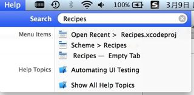
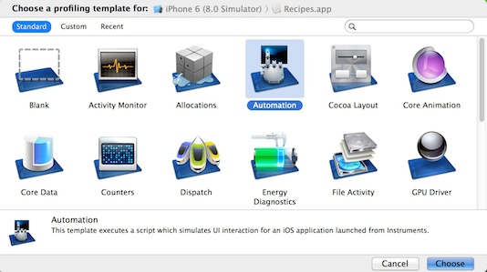
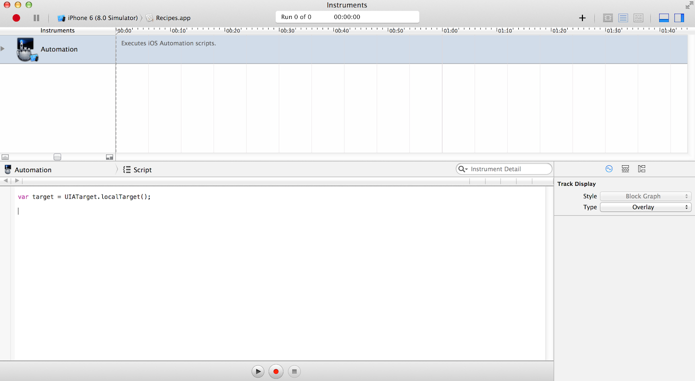
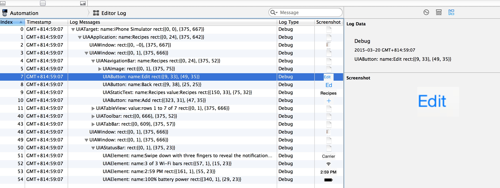

# Notes of Using UIAutomation
*Written By mengting.chen*

此文记录如何以Xcode自带的Recipes工程为例，来简单的使用UIAutomation(一个用java script写iOS自动化脚本的框架)

首先在xcode中search&download此工程，在help-search中搜索recipes，打开帮助文档，对应页面选 Open Project
第二次搜索可以看到：


## 1.启动方法
cmd + I 或者project - run profile 启动instruments
或者Xcode > Open Developer Tool > Instruments


选择Automation后可以看到自动生成的脚本


## 2.获取控件树
脚本里加上`target.logElementTree();`
运行可以看到输出的一些log，从这些log里可以看到所有的界面控件元素都是以树形结构组织起来的，而且选中其中一条会有对应的详细信息和截图（右下角的Extended Detail视图），从这个可以快速了解界面元素结构

PS：可以右击-export保存js脚本

## 3.获取控件元素
*UIAElement*是所有控件元素的基类，
每一个可以被访问的*UIKit*控件都可以用一个*Javascript*对象来描述，它就是一个*UIAElement*。*UIAElement*有几个属性：*name, value, elements, parent*  
*UIATarget、UIAApplication*不过是相对高级的对象

一般获取元素的方法就是通过`.elements()`得到此元素的子元素数组（Element Array），再通过*name*或者索引值确定元素

每一个*UIAElement*对象的子控件可以通过下面的方法进行访问：*buttons(), images(), scrollViews(),textFields(), webViews(), segmentedControls(), sliders(), staticTexts(), switches(), tabBar(),tableViews(), textViews(), toolbar(), toolbars()*等等…… 

那么拿到那个*edit button*可以这么写

```java script
//树的根，UIATarget对象
var target = UIATarget.localTarget(); 
//返回一个UIAApplication对象，可以理解为整个app
var app = target.frontMostApp(); 
//一个UIAWindow对象，当前窗口对象（app运行时会有多个显示页面/窗口）
var window = app.mainWindow(); 
//得到name为Recipes的navigationBar对象（window的navigationBar对象同样可以有多个，所以window.navigationBars()得到的是一个数组）
var navigationBar = window.navigationBars()["Recipes"]; 
//得到name为Edit的UIAButton对象
var editButton = navigationBar.buttons()["Edit"]; 
//触发点击操作
editButton.tap() ; 
```
 
## 4.常用交互方式：
包括点击、滑动、拖拽、缩放、使用模拟键盘输入、程序屏幕显示输出信息（如所有文本控件都有*setValue*和*value*方法可以用来设置和获取屏幕输出信息）

### 4.1 Element方式

#### 1)点击
*tap()* 对*Button*或者*TableCell*都可以用，
更高级的，比如在某个位置*tap*：*tapWithOptions(options)* 例如对于kindle那样在不同位置*tap*代表不同意思的就可以用
双击*doubleTap()*、双指点击*twoFingerTag()*

#### 2)滑动或拖拽
在*UIAutomation*中这两区别不大，唯一在于操作时的延时时间不同  
滑动：*flickInsideWithOptions()*  
拖拽：*dragInsideWithOptions()*

```java script
UIAElement.flickInsideWithOptions({touchCount:2, startOffset:{x:0.5, y:0.9}, endOffset:{x:1.0, y:0.9}});
UIAElement.dragInsideWithOptions({touchCount:2, startOffset:{x:0.5, y:0.9}, endOffset:{x:1.0, y:0.9}, duration:1});
//touchCount*表示使用的手指个数
//duration*表示手指接触屏幕的时间，默认为0
```

### 4.2 Target方式
如果你不想操作具体的某个元素，你也可以直接根据屏幕上指定的坐标点进行操作，但是坐标点就不是[0,0]-[1,1]了

#### 1)点击
*tap()、tapWithOptions()、doubleTap()、twoFingerTap()*依旧有效，只是参数不同

```java script
UIATarget.localTarget().tap({x:100, y:200});
UIATarget.localTarget().tapWithOptions({x:100, y:200},{tapCount:1, touchCount:2, duration:1});
//tapCount为点击次数，默认为1；
//touchCount为点击时使用的手指个数，默认为1；
//duration为点击时手指接触屏幕的时间，默认为0
UIATarget.localTarget().doubleTap({x:100, y:200});
UIATarget.localTarget().twoFingerTap({x:100, y:200});
```

#### 2)拖拽

```java script
UIATarget.localTarget().dragFromToForDuration({x:160, y:200},{x:160,y:400},1);
UIATarget.localTarget().flickFromTo({x:160, y:200},{x:160, y:400});
```
滑动：*flickFromTo()*  
拖拽：*dragFromToForDuration()*


#### 3)缩放:
一般在浏览图片时会用到这种多指触控的操作来放大、缩小

```java script
UIATarget.localTarget().pinchOpenFromToForDuration({x:20, y:200},{x:300, y:200},2);
UIATarget.localTarget().pinchCloseFromToForDuration({x:20, y:200}, {x:300, y:200},2);   
```
注意，当你指定操作的时间间隔的时候，它是有特定的范围的，即：拖拽操作的时间间隔必须大于或者等于0.5秒，小于60秒 

使用目前发现的问题：

* script view和editor log view没法一齐展示
* editor log无法清空，调试很不方便
* 跑脚本时，如果模拟器里面没有把对应的app开起来或者找不到对应的控件，有时不会报错，但是脚本也不执行
* dragInsideWithOptions对iOS7不好使
* 组织测试用例不太方便，也没有assert之类的，都靠logFail、logPass


## 5.一些其他操作
### 5.1)获取系统信息
在实际测试中可以把系统信息汇总输出到测试报告中

```java script
var target = UIATarget.localTarget();
UIALogger.logMessage(“Device model: ”+ target.model());
UIALogger.logMessage(“Screen width: “ + target.rect().size.width);
UIALogger.logMessage(“Screen height: “ + target.rect().size.height);
UIALogger.logMessage(“Name “ + target.name());
UIALogger.logMessage(“Device OSName:“ + target.systemName());
UIALogger.logMessage(“Device OSVersion:“ + target.systemVersion());
```
### 5.2)模拟用户坐标

```java script
target.setLocation({“longitude”: 121.41, “latitude”: 31.217});
```
### 5.3)锁屏、放后台

```java script
target.lockForDuration(2); //锁屏2秒后恢复
target.deactivateAppForDuration(2); //放后台2秒后恢复
```
### 5.4)摇一摇

```java script
target.shake();
```
### 5.5)等待

在页面和页面之间甚至动作和动作之间需要一定的等待时间，如脚本中用到的delay(1)。等待固定时间对于需要请求网络的情况不太好，可以利用iOS对页面加载需要等待的两种处理方式：

* 系统级别的网络加载标识。在网络信号右侧，页面有网络加载时，带动态效果的这个标识就会出现，网络请求完毕会自动消失；
* 应用级别的等待提示。有网络请求或者大量文件读写需要用户等待时，开发者应该在应用程序中显示ActivityIndicator，提示用户此时需要等待。 

## 6. 基于UIAutomation的扩展自动化框架
### 6.1 [TuneupJs](http://www.tuneupjs.org/ https://github.com/alexvollmer/tuneup_js.git)
优点：相比原生的*UIAutomation*，增加了*assert*系列方法，而且组织用例也稍微好了些，不需要通过import的方式组织


### 6.2 [芈君的ynm3k](https://github.com/douban/ynm3k)
最大的优点：在*TuneupJs*的基础上，定位控件元素不需要像之前一样总是根据树的结构一层层获取，可以直接根据*Name、ClassType*及两者组合来定位控件，但是貌似都很久不维护了
代码clone下来先运行setup.sh

ynm3k中对5.5中两种等待都有实现，如：

```java script
Waiter.wai4SystemIndicator(15); 
Waiter.wait4Indicator(15);
//最长等待15s，15s内监测到网络加载标识消失就自动结束 
```

## 7.基于UIAutomation的类似Monkey测试脚本
<https://github.com/jonathanpenn/ui-auto-monkey>
直接import进instruments就可以跑

## 参考资料：

1.[官方文档](https://developer.apple.com/library/ios/documentation/DeveloperTools/Conceptual/InstrumentsUserGuide/Introduction/Introduction.html)  
2.有人[翻译的instruments用户使用手册](http://wenku.baidu.com/link?url=92hNsE702xR5igdRfsrz_aRi9mdEctaWLONhxsVoEo1yM8yW3nw0liJAFKpfaNQVRpAzSy0BrNJyRp4Jrg8tJFAQ5N-WNYeZhY8Lb5mum03)  
3.芈君的《ios测试指南》  
4.[一个英文博客](http://blog.manbolo.com/2012/04/08/ios-automated-tests-with-uiautomation)[及其部分翻译版](http://www.cnblogs.com/vowei/archive/2012/08/10/2631949.html)

     
