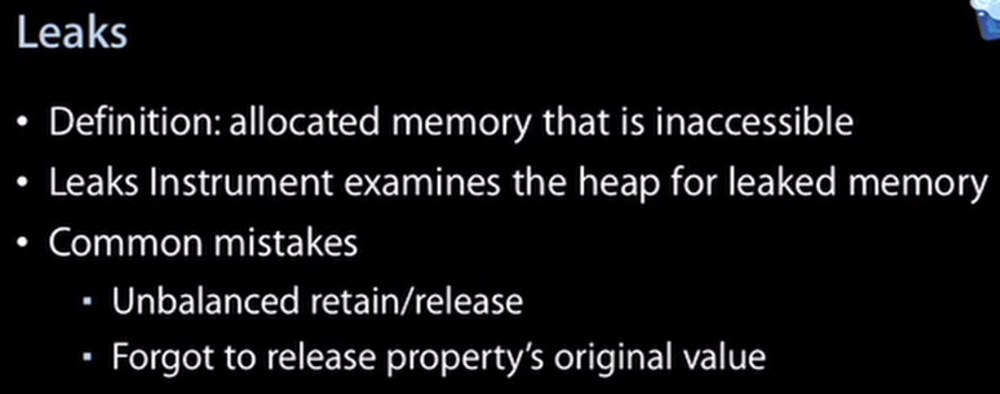

# Performance Test and Optimization for iOS APPs
使用以下Instruments工具的方法：
Mac连接真机（*只推荐使用模拟器来做内存相关测试，因为有额外的模拟内存低等功能，最终还是推荐用真机*），Xcode中使用cmd+I开启Instruments（target需选用真机，注意应用程序必须是developer证书签名才能运行在真机），选择Blank，在Library中选择对应的库
## 1 时间监测Time Profiler
用Time Profiler可以查看各个方法的耗时，需要同时注意首次启动和从后台启动两种情况，记得勾上"Invert call tree"和"Hide system libraries"

>During the recording, *place flags in the timeline to identify events such as the end of the launch process*
>
>Before looking at the Call Tree, always define an Inspection Range, using the buttons in the toolbar. Use the flags you have placed during recording to identify the section of your code you want to analyze.
>
>At best, launching your app should not take more than 2-3 seconds. **If your own code’s percentage of the total launch time exceeds 20-30%, that could indicate a problem.**

iOS会对APP的各种时间做限制，超过下图的时间限制就会被系统强制停止

一般启动时间在2~3秒是比较能接受的，建议在lauching时遵循以下原则

## 2 页面绘制监测Core Animation

### 2.1 Offscreen Rendered Yellow
用Core Animation的Offscreen Rendered Yellow来标黄各页面的重复绘制区域，非必要的重复渲染可以去掉
### 2.2 Color Blended Layers
用Core Animation的Color Blended Layers来找出半透明的non-opaque区域，一般如果顶层是opaque的那么绘制会快很多。

深红色的往往就是绘制很吃力的区域，这些地方可能有多个半透明层。如果页面很红，需要考虑把元素层次减少或者将背景层选为不透明。

>Dark red indicates that this part is quite hard to render. There are probably multiple non-opaque layers on top of eachother. If your apps shows too much red, consider to flatten your view hierarchy. *Add backcolors and set opaque to YES for layers that are fully opaque.* In this way you tell the rendering mechanism that the layers below this layer don't have to rendered.

### 2.3 Misaligned Content
这个选项会帮助标黄标红那些非整数型位置的像素,这些像素在绘制到真机时需要被转换为整数，所以额外耗资源。
>Although the coordinate system in Core Graphics uses floating point units, these coordinates have to mapped to a device’s fixed pixel grid before they are displayed. Make sure to draw your content on integral coordinates to avoid aliasing work for the graphics system, which both costs performance and makes your graphics look bad. The Core Animation instrument highlights misaligned content in magenta.

## 3 内存监测Allocations + Leaks + VM Tracker + Activity Monitor
用这4个工具可以用来监控内存，Allocations用于监控对象调用了alloc方法申请内存以后的内存使用情况，会记录对象生命周期内内存引用计数的变化。对象被正常释放后就不再继续追踪。
Leaks用于监控内存泄露，检测到以后可以用Allocations帮忙定位问题。

注意iOS没有swap file，所有操作都必须在RAM中进行，超过系统的RAM限制，就可能Crash。系统会做这些来保证RAM的充裕：

### 3.1 Leaks
一般先用这个工具监测是否有内存泄露，所有内存泄露都应该被解决，但是有些*潜在*的内存泄露不会被它检测出来，只能通过Allocations来分析

### 3.2 Activity Monitor
勾上Track inspection head可以看到一个特定方法在一段时间内某个时刻的占用内存和随时间变动的变化趋势
>The Activity Monitor can be used to compare your app’s resource usage to other apps that are currently in the background. For example, sort the app list by Real Memory and select the Track inspection head option. When you now drag the inspection head across the timeline you just recorded, you will see your own app rise (or fall) among the other backgrounded apps depending on how much memory you use.

### 3.3 Allocations
注意这个工具不会把APP的所有内存都计入在内，但是它能帮助获取一些趋势

* 持续增长的内存量往往意味着可能存在内存泄露

>A constantly growing allocations chart is obviously a bad sign. It usually indicates some pretty severe memory leaks. If you don’t fix this problem, your app will crash sooner or later because it runs out of memory.

* 同样动作的重复，不应该导致内存增长

>When you repeat the same action in your app over and over again (for example, switch to another screen and then go back to the first screen), your memory usage should not increase. *On the allocations chart, you would usually see an increase the moment you start the action (because a new view has to be created) and a decrease soon after going back to the starting position, especially when you repeat this action for multiple times.*
>
>**If you see none or only part of the memory being reclaimed, it is a sign of a leak or a block of abandoned memory**, possibly caused by a retain cycle. Use Instrument’s Heapshot Analysis to track these problems down. By clicking **Mark Heap** between repeating the same action, Instruments can show you exactly which objects did not get freed. Looking at the list can usually get you on the right track.

* Abandoned Memory
这一类的内存是应该主动处理掉的

* 明显的内存峰，可能导致系统将一些页面从内存清掉，因而造成Crash，所以要尽量避免

>Large memory spikes can cause the system to evict read-only pages from memory because the OS knows it can read them back later from disk. Because your app’s code is also part of these reloadable read-only pages, a large memory spike, even for just a few milliseconds, can cause your app to stutter when the system evicts and later has to reload your app’s code. Try to avoid them if you can.

这些尖峰是应该通过主动将对象置为nil释放内存等措施来消除掉的

### 3.4 VM Tracker
这个工具比Allocations记录的数据真实

>The VM Tracker instruments is useful because it can show you the real amount of memory your app uses. The two columns, *Resident Size* and Dirty Size, show the amounts of memory that can be mapped out to disk or not be reclaimed, respectively.

## 4 流量监测Network Activity
可以使用Network Activity，其中Cell表示运营商流量，主要用在两个方面：

* 确认在各种网络接入情况下APP的功能正确性: wifi+不同的手机上网制式和网速，测试时可以加上丢包率模拟真实的网络环境
* 如果被测试的应用程序有区分上网方式的功能，例如非wifi不显示图片或者不下载资源，就应该进行此项测试

## 参考资料

* [how-to-make-your-apps-feel-responsive-and-fast](http://www.touchwonders.com/blog/how-to-make-your-apps-feel-responsive-and-fast-part-2)
[中译版](http://blog.csdn.net/zixiweimi/article/details/39183245)
* [michael-jurewitz-on-performance-measurement](http://oleb.net/blog/2011/11/ios5-tech-talk-michael-jurewitz-on-performance-measurement/)
* [Apple为开发者提供的一些教学视频](https://developer.apple.com/videos/ios/) 

