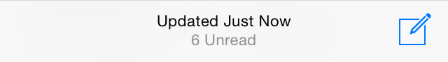

#Tips From Apple's User Experience Documentation - UI Design Basics

##1 Designing for iOS
>* Whether you’re redesigning an older app or creating a new one, consider approaching the job in this way:  
* First, look past the UI to the app’s core functionality and affirm its relevance.  
* Next, use the themes of iOS to inform the design of the UI and the user experience. Add details and embellishments with care and never gratuitously.  
* Finally, be sure to design your UI to adapt to various devices and modes so that users can enjoy your app in as many contexts as possible.
* Throughout the process, be prepared to ***defy precedent***, ***question assumptions***, and let a ***focus on content*** and functionality motivate every design decision.

个人认为最有道理的：确保UI和核心功能的相关性，不要毫无理由的添加细节和装饰，保证在多款设备上可用性，永远记得内容是最重要的。
###1.1 Defer to Content
以iOS自带的Weather为例，说明可以使用整个屏幕来贡献内容；以Map为例说明一些阴影、标注等等UI应该是辅助，不要抢占**content**的重要性；以上滑屏幕出现的控制中心为例说明透明的UI可以不抢占整个屏幕。
###1.2 Provide Clarity
以Messages为例说明[negative space](https://en.wikipedia.org/wiki/Negative_space)的使用可以让APP显得更简洁，内容更突出；以Notes为例说明如何利用颜色达到简洁的效果;无论使用系统字体还是自定义字体，都要注意使用Dynamic Type来适配用户自定义的字号；以Contacts为例说明无边框Button的使用。
###1.3 Use Depth to Communicate
以Calendar、Notes里多条Note、主界面上的文件夹展示等说明利用多个Layer来表达一种层级关系。用户借此知道如何交互。
##2 [iOS App Anatomy](https://developer.apple.com/library/ios/documentation/UserExperience/Conceptual/MobileHIG/Anatomy.html#//apple_ref/doc/uid/TP40006556-CH24-SW1)
这一块主要讲例如Navigation bar、Tab bar、Alert、Map view、Toolbar button等等iOS APP中常用的组件。组件一般分成4类：
>* **Bars**. Bars contain contextual information that tells users where they are and controls that help users navigate or initiate actions.  
* **Content views**(such as collection views and table views). Content views contain app-specific content and can enable behaviors such as scrolling, insertion, deletion, and rearrangement of items.  
* **Controls**(such as buttons and sliders). Controls perform actions or display information.  
* **Temporary views**(such as alerts and action sheets). Temporary views appear briefly to give users important information or additional choices and functionality.  
* Programmatically, *a UI element is a type of view because it inherits from UIView*. A view knows how to draw itself onscreen, and it knows when a user touches within its bounds. Controls, content views, and temporary views are all types of views.

不同组件(也就是不同view)之间都是通过controller来控制的。一个App的window、view之间的关系通过下图展示的很清晰：

更多可以参看<https://developer.apple.com/library/ios/documentation/UserExperience/Conceptual/MobileHIG/Bars.html#//apple_ref/doc/uid/TP40006556-CH12-SW1>

##3 [Adaptivity and Layout](https://developer.apple.com/library/ios/documentation/UserExperience/Conceptual/MobileHIG/LayoutandAppearance.html#//apple_ref/doc/uid/TP40006556-CH54-SW1)
###3.1 Build In Adaptivity
iOS设备的两种orientation: **portrait**（竖屏）、**landscape**（横屏）。从iOS8开始可以使用size classes and Auto Layout使得App自适应这两种屏幕显示。
###3.2 Provide a Great Experience in Each Environment
官方文档提供了一些guidelines来达到让你的APP在各种devices和orientation中完美适配的目的
>* Maintain focus on the primary content in all environments.
>* Avoid gratuitous changes in layout.
>* Be straightforward if your app runs in only one orientation.Avoid displaying a UI element that tells people to rotate the device.Support both variants of an orientation.

（如:支持横屏的App应该考虑无论Home键在左侧还是右侧，如果用户旋转180°，App的内容也应该对应变化）
>* If your app interprets changes in device orientation as user input, handle rotation in app-specific ways.

###3.3 Use Layout to Communicate
>* Make it easy to focus on the main task by elevating important content or functionality.

例如将重要内容放在左上方，下面这张图说明了屏幕上不同区域重要性的不同。

>* Use visual weight and balance to show users the relative importance of onscreen elements.

例如大的控件重要性永远大于小的
>* Make sure that users can understand primary content at its default size.
>* Be prepared for changes in text size. 
>* As much as possible, avoid inconsistent appearances in your UI.
>* Make it easy for people to interact with content and controls by giving each interactive element ample spacing. Give tappable controls a hit target of about 44 x 44 points.

(例如：搜索框右侧的叉叉按钮可点击区域的问题)
##4 Starting and Stopping
###4.1 Start Instantly
用户只会花1-2分钟来决定是否继续使用App，所以千万不要像PC端一样让用户安装完还需要重启系统什么的。
>* **As much as possible, avoid displaying a splash screen or other startup experience.**
>* Avoid asking people to supply setup information. 
>Focus on the needs of 80 percent of your users.Get as much information as possible from other sources.If you must ask for setup information, prompt people to enter it within your app.
>* Delay a login requirement for as long as possible. It’s best when users can navigate through much of your app and use some of its functionality without logging in. 
>* **Think carefully before providing an onboarding experience.** (Onboarding introduces an app’s features and explains how to perform common tasks.)
>Give users only the information they need to get started. 
>Use animation and interactivity to engage users and help them learn by doing. 
>Make it easy to dismiss or skip the onboarding experience.
>* Avoid asking users to rate your app too soon. 
>* In general, launch in the device’s current orientation. However, if your app runs in only one orientation, you should always launch in that orientation and let users rotate the device if necessary.
>* **Provide a launch file or image.** iOS displays a launch image the moment your app starts—giving users the impression that your app is fast and giving your app enough time to load content.
>* If possible, avoid requiring users to read a disclaimer or agree to an end-user license agreement before they can do anything else.
>* When your app restarts, restore its state so users can continue where they left off. 

###4.2 Always Be Prepared to Stop
>* An iOS app never displays a Close or Quit option. 
>**Save user data as soon as possible and as often as reasonable**.
>Save the current state when stopping at the finest level of detail possible. 
>* Never quit an iOS app programmatically. （用户会认为这是crash）
>**If all app features are unavailable, display a screen that describes the situation and suggests a correction**.
>If only some app features are unavailable, display either a screen or an alert when people try to use the feature.

##5 [Navigation](https://developer.apple.com/library/ios/documentation/UserExperience/Conceptual/MobileHIG/Navigation.html#//apple_ref/doc/uid/TP40006556-CH53-SW1)
>Your job is to implement navigation in a way that supports the structure and purpose of your app without calling attention to itself.
(让用户尽量感知不到导航)

一般导航分成三种：

* Hierarchical： 用户是一级级的进入到目标功能页面，如果想要回到某个之前的功能，只能通过回退到首页一级级沿另外的路径进入，例如Settings和Mail
* Flat： 主要功能在首页都展示出来了，所以用户在首页就可以直接选择进入目标功能页，例如Music和App Store
* content- or experience-driven，下级导航往往是跟随用户已经选择的功能变化，很多游戏App是这么设计的
* 这几种的混合

但是无论结构如何，都应该满足这些原则：
>* Users should always know where they are in your app and how to get to their next destination.
>* Use a navigation bar to give users an easy way to traverse a hierarchy of data. 
>* Use a tab bar to display several peer categories of content or functionality.
>* Use a page control when each app screen represents an individual instance of the same type of item or page.
>* **In general, it’s best to give users one path to each screen.**

##6 [Modal Contexts](https://developer.apple.com/library/ios/documentation/UserExperience/Conceptual/MobileHIG/Modal.html#//apple_ref/doc/uid/TP40006556-CH64-SW1)
一个关于Modal Context的简介图

如果不是属于这两种情况，不要使用
>* It’s critical to get the user’s attention
>* A self-contained task must be completed—or explicitly abandoned—to avoid leaving the user’s data in an ambiguous state

##7 [Interactivity and Feedback](https://developer.apple.com/library/ios/documentation/UserExperience/Conceptual/MobileHIG/InteractivityInput.html#//apple_ref/doc/uid/TP40006556-CH55-SW1)
###7.1 Users Know the Standard Gestures
常用的手势 tap, drag, and pinch，在所有App中都必须尽量保证一致，因为用户的习惯。
这些手势的一般含义：

* Tap：按压，点击
* Drag：按住从一边拖到另外一边(To scroll or pan—that is, move side to side.)
* Flick：快速的滑动(To scroll or pan quickly.)
* Swipe：一根指头的swipe往往指类似从一个页面滑回上一个页面的右滑、为了露出某个item的删除按钮的左滑；在iPad上四指swipe的上滑可以达到双击home键的效果，用来切换App
* Double tap: 以点击点为中心放大或者缩小
* Pinch：也用来放大或者缩小
* Touch and hold：对于一段文字而言就是提供一些select之类的选项
* Shake：撤销或者重新执行

>* Avoid associating different actions with the standard gestures.
>* Avoid creating custom gestures that invoke the same actions as the standard gestures. (人都是有惰性的)
>* Use complex gestures as shortcuts to expedite a task, **not as the only way to perform it**. As much as possible, **always give users a simple, straightforward way to perform an action, even if it means an extra tap or two**. Simple gestures let users focus on the experience and the content, not the interaction.（宁愿要简单动作的重复）
>* In general, avoid defining new gestures unless your app is a game.

###7.2 Interactive Elements Invite Touch
>the built-in apps use a variety of cues, including color, location, context, and meaningful icons and labels

以Contacts为例，在某个联系人页面，可交互的控件都是蓝色的；在Calendar里，左上角的后退按钮有一个表示后退的icon还有一个title提示用户上一个页面是什么

>In a content area, add a button border or background only if necessary. **Buttons in bars, action sheets, and alerts don’t need borders** because users know that most of the items in these areas are interactive. In a content area, on the other hand, a button might need a border or a background to distinguish it from the rest of the content. For example, Music, Clock, Photos, and App Store use such buttons in a few specific contexts.（在内容展示为主的页面，button可能需要边界，但是Altert、bars这些里面的button大家都知道是可交互的，就没必要了）

###7.3 Feedback Aids Understanding
>* As much as possible, integrate status and other relevant feedback information into your UI.(在不干扰content的情况下展示有利于用户的反馈)

>* Avoid unnecessary alerts. **If users see too many alerts that don’t contain essential information, they quickly learn to ignore all alerts.**

###7.4 Inputting Information Should Be Easy
>* Make it easy for users to make choices. For example, you can **use a picker or a table view instead of a text field**
>* Get information from iOS, when appropriate.
>* Balance a request for input by giving users something useful in return.

##8 [Animation](https://developer.apple.com/library/ios/documentation/UserExperience/Conceptual/MobileHIG/Animation.html#//apple_ref/doc/uid/TP40006556-CH57-SW1)
>* Add animation cautiously(不必要的动画会降低性能，分散用户注意力)
>* Use animation consistently throughout your app. 
>* In general, strive for realism and credibility in custom animation. 例如如果使用下滑的方式展现了一个页面，就应该用上滑的方式把它隐藏回去（类似通知栏），不要尝试用继续下滑来隐藏它，这有悖用户本能的反应。

##9 Color and Typography
###9.1 Color Enhances Communication
>* If you create multiple custom colors, make sure they work well together. 
>* Pay attention to color contrast in different contexts.
>* **Be aware of color blindness.**
>* Consider choosing a key color to indicate interactivity and state.
>* **Avoid using the same color in both interactive and noninteractive elements.**
>* Color communicates, but not always in the way you intend.**Spend time to research how your use of color might be perceived in other countries and cultures.**
>* In most cases, don’t let color distract users. 

###9.2 Text Should Always Be Legible
>* When appropriate, adjust the layout when the user chooses a different text size.
>* In general, use a single font throughout your app. 

##10 [Terminology and Wording](https://developer.apple.com/library/ios/documentation/UserExperience/Conceptual/MobileHIG/FeedbackCommunication.html#//apple_ref/doc/uid/TP40006556-CH56-SW1)
>* **Use terminology that you’re sure your users understand.**
>* Use a tone that’s informal and friendly, but not too familiar. 
>* Think like a newspaper editor, and watch out for redundant or unnecessary words.
>* Give controls short labels or use well-understood icons.
>* Take care to be accurate when describing dates.（今天、明天这样的用法会显得更亲切，但是你考虑到用户不同的时区了吗？）

##参考文档
###1 [苹果官方文档](https://developer.apple.com/library/ios/documentation/UserExperience/Conceptual/MobileHIG/index.html) [中文版](http://isux.tencent.com/ios8-human-interface-guidelines.html)
###2 [Android Design Principles（实际上是Android 4.4设计规范）](http://developer.android.com/design/get-started/principles.html) [中文版](http://www.apkbus.com/design/get-started/principles.html)
 
[Android Material Design（实际上是Android 5设计规范）]
(http://www.google.com/design/spec/material-design/introduction.html) [中文版](http://wiki.jikexueyuan.com/project/material-design/)